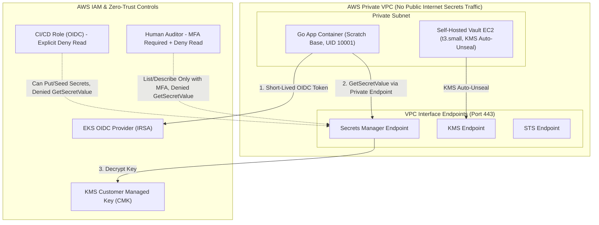

# AWS Secrets Management & Zero-Trust Access Demonstration

[](file:///c:/GitHub/aws-secrets-zerotrust/docs/zero-trust-model.md)
[](https://github.com/YOUR_ORGANIZATION/aws-secrets-zerotrust/actions/workflows/ci.yml)
[](https://www.terraform.io/)
[](https://go.dev/)
[](https://aws.amazon.com/secrets-manager/)
[](https://www.vaultproject.io/)

Production-grade demonstration of **Secretless Application Architecture** on AWS using **AWS Secrets Manager** and **HashiCorp Vault** (self-hosted EC2 with KMS auto-unseal). Features **IRSA (IAM Roles for Service Accounts)**, **KMS Customer Managed Keys (CMK)** with automatic rotation, **VPC Interface Endpoints**, and **least-privilege IAM roles with explicit Deny rules** — eliminating all hardcoded static credentials.

---

## Architecture Overview



---

## Key Features & Security Architecture

1. **Dual Provider Interface**: Abstracted Go `Provider` interface supporting both AWS Secrets Manager and HashiCorp Vault with in-memory TTL caching and circuit-breaker fallback.
2. **Zero Static Credentials (IRSA & OIDC)**: Pods authenticate to AWS using short-lived EKS OIDC tokens. GitHub Actions uses OIDC federation — zero long-lived AWS secret keys stored in GitHub.
3. **Explicit IAM Deny Rules**:
   - **App Role**: Allowed `GetSecretValue` on specific secret ARNs only; explicitly `Deny` on `DeleteSecret` and `PutSecretValue`.
   - **CI Role**: Allowed `PutSecretValue` and `CreateSecret` (seeding); explicitly `Deny` on `GetSecretValue` (cannot exfiltrate secrets).
   - **Auditor Role**: Requires `aws:MultiFactorAuthPresent=true`; explicitly `Deny` on `GetSecretValue`.
4. **Network Security**: Private AWS Interface VPC Endpoints (`secretsmanager`, `kms`, `ssm`, `sts`). All traffic stays within private VPC CIDR.
5. **KMS CMK Key Management**: Customer Managed Keys with annual automatic key rotation enabled.
6. **Zero-Downtime Secret Rotation**: Lambda-based database secret rotation with in-memory TTL cache stale-while-revalidate background refresh.
7. **Hardened App & Container**: Multi-stage Docker build targeting `scratch`, non-root user (UID 10001), read-only root filesystem, dropped Linux capabilities.
8. **DevSecOps Pipeline**: Integrated `trufflehog` secret scanning, `gosec` AST security analysis, and `Trivy` container CVE scanning in CI.

---

## Directory Structure

```
aws-secrets-zerotrust/
├── terraform/
│   ├── modules/
│   │   ├── vault/           # EC2 self-hosted Vault with KMS auto-unseal
│   │   ├── secrets-manager/ # AWS Secrets Manager secrets, KMS CMK, rotation
│   │   ├── iam/             # IRSA, CI OIDC, least privilege IAM roles with explicit Deny
│   │   └── networking/      # VPC, private subnets, VPC Endpoints
│   └── environments/
│       ├── dev/             # Short KMS deletion (7 days), rotation disabled
│       └── prod/            # KMS deletion (30 days), rotation enabled (30 days), MFA enforcement
├── app/
│   ├── cmd/server/main.go   # Go 1.22 HTTP server with fail-fast secret validation
│   ├── internal/
│   │   ├── secrets/         # Provider interface, AWS & Vault SDK clients, TTL cache
│   │   ├── config/          # Environment configuration loader
│   │   └── handlers/        # /health, /ready, /demo, /metrics endpoints
│   └── Dockerfile           # Multi-stage scratch build, non-root UID 10001
├── vault-config/
│   ├── policies/            # Least privilege Vault HCL policies (dev/prod/admin)
│   ├── auth/                # AWS IAM and AppRole auth configuration files
│   └── secrets/             # KV v2 setup & rotation scripts
├── k8s/                     # IRSA ServiceAccount, deployment, service, Vault Agent sidecar
├── .github/workflows/       # CI (TruffleHog, Gosec, Trivy), Terraform plan/apply, rotation test
├── scripts/                 # Bootstrap (S3/DynamoDB/KMS), Vault init, setup AWS auth, e2e demo
├── docs/                    # Zero-trust model, secret rotation strategy, threat model
├── .gitignore
└── README.md
```

---

## Deployment & Setup Guide

### 1. Prerequisites
- AWS CLI v2 configured with Administrator credentials
- Terraform >= 1.5.0
- Go 1.22+
- kubectl & Docker

### 2. Bootstrap Remote Backend (S3 + DynamoDB + KMS)
```bash
chmod +x scripts/*.sh vault-config/secrets/*.sh
./scripts/bootstrap.sh
```

### 3. Deploy Infrastructure via Terraform

#### Development Environment
```bash
cd terraform/environments/dev
terraform init
terraform plan
terraform apply -auto-approve
```

#### Production Environment
```bash
cd terraform/environments/prod
terraform init
terraform plan
terraform apply -auto-approve
```

### 4. Initialize HashiCorp Vault
```bash
# Obtain Vault private IP from terraform output
export VAULT_ADDR="http://<VAULT_PRIVATE_IP>:8200"

# Initialize Vault & save unseal keys to AWS Secrets Manager
./scripts/vault-init.sh dev

# Configure Vault AWS IAM Auth Method
./scripts/setup-aws-auth.sh dev

# Seed Vault KV v2 secrets
./vault-config/secrets/setup-kv.sh
```

### 5. Run Application Locally or on Kubernetes
```bash
# Local execution
cd app
export APP_ENV=dev
export SECRET_PROVIDER=aws-secrets-manager
export AWS_REGION=us-east-1
export SECRET_PATH_PREFIX=myapp/dev/app
go run ./cmd/server/main.go

# Kubernetes Deployment
kubectl apply -f k8s/namespace.yaml
kubectl apply -f k8s/serviceaccount.yaml
kubectl apply -f k8s/deployment.yaml
kubectl apply -f k8s/service.yaml
```

### 6. Execute End-to-End Demo Script
```bash
./scripts/demo.sh dev
```

---

## Resume & LinkedIn Summary Block

### One-Line GitHub Description
Secretless app architecture on AWS — HashiCorp Vault & Secrets Manager with IRSA, KMS CMK, VPC endpoints, and least-privilege IAM enforcing zero hardcoded credentials end-to-end.

### Resume Bullet
> "Implemented secretless application architecture on AWS using HashiCorp Vault and Secrets Manager with IRSA authentication, KMS customer-managed keys, VPC endpoints for private secrets traffic, and least-privilege IAM roles with explicit Deny rules — eliminating all hardcoded credentials and enforcing zero-trust access across app, CI, and human access tiers."

### LinkedIn Project Description
> Built a production-grade zero-trust secrets management platform on AWS demonstrating secretless architecture end-to-end. The app authenticates to AWS via IRSA (no stored credentials), fetches secrets from Secrets Manager or HashiCorp Vault at runtime through an abstracted provider interface, caches with TTL, and transparently handles rotation. IAM roles use explicit Deny rules so the app literally cannot write or delete its own secrets. The CI pipeline uses OIDC and can seed secrets but is explicitly denied reading them. Human access requires MFA and still cannot retrieve secret values — only metadata. All secrets traffic stays in the VPC via Interface endpoints, never touching the public internet. CI runs trufflehog, gosec, and Trivy on every commit.

---

## License

MIT License. See LICENSE for details.
