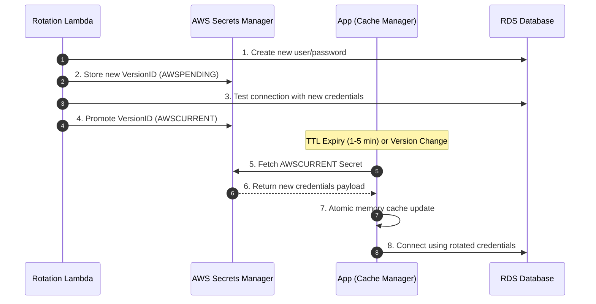

# Secret Rotation Strategy & Lifecycle Management

## Overview

Static, long-lived credentials represent one of the primary vectors for enterprise data breaches. This document outlines the rotation strategy implemented in this repository for every class of sensitive secret.

---

## Secret Rotation Matrix

| Secret Category | Target Engine | Strategy | Frequency | Downtime Impact |
| :--- | :--- | :--- | :--- | :--- |
| **Database Master Credentials** | AWS Secrets Manager / RDS | AWS Lambda 4-step rotation (createSecret, setSecret, testSecret, finishSecret) | Every 30 Days (Prod) | Zero Downtime |
| **Third-Party API Keys** | Vault KV v2 / AWS SM | Dual-Key Overlap Window (v1 valid for 24h alongside v2) | Every 90 Days / On-Demand | Zero Downtime |
| **Vault Auto-Unseal Key** | AWS KMS | AWS KMS Customer Managed Key Annual Auto-Rotation | Every 365 Days | Transparent |
| **Vault Unseal & Root Tokens** | AWS Secrets Manager | One-time bootstrap initialization storage, followed by root token revocation | Post-Bootstrap | N/A |

---

## Zero-Downtime Application Handling

When a secret is rotated in AWS Secrets Manager or HashiCorp Vault, the application updates seamlessly without requiring pod restarts or causing service interruption:

### Key Mechanisms:
1. **Short TTL Memory Cache**: Secrets are cached in memory for a short TTL (1 minute in `prod`, 5 minutes in `dev`).
2. **Stale-While-Revalidate**: Upon cache expiry, the application immediately returns the cached value while initiating an asynchronous background fetch for the updated `VersionID`.
3. **Version Tracking**: The SDK client monitors the returned AWS `VersionId` or Vault KV v2 `version`. If a version change is detected, the cache is instantly refreshed.
