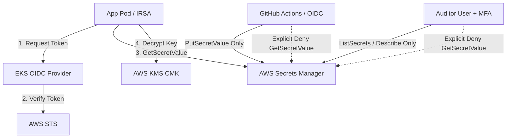

# Zero-Trust Architecture & Threat Boundary Specification

## Overview

This repository demonstrates a **Secretless Application Architecture** on AWS. In traditional cloud applications, sensitive credentials (database passwords, API keys, certificates) are often baked into container image environment variables, written to `.env` files, or mounted as plain text files on disk. 

Under the **Zero-Trust Model**, credentials are never static, never committed, and never stored on persistent disk. Authentication is derived entirely from **cryptographic identity** (AWS IRSA / OIDC), and access is constrained by least-privilege policies with explicit Deny rules.

---

## Core Security Pillars

### 1. Secretless Execution & Identity Federation
- **Kubernetes IRSA (IAM Roles for Service Accounts)**: Pods authenticate to AWS using short-lived (1 hour) OIDC tokens issued by EKS. No AWS access keys or static secret values exist in container environment variables.
- **Vault AWS IAM Auth**: When accessing HashiCorp Vault, the application generates a signed `sts:GetCallerIdentity` request. Vault verifies this request against AWS STS to validate caller identity without pre-shared tokens.

### 2. Explicit IAM Deny Rules (Belt & Suspenders)
AWS IAM policies utilize explicit `Deny` statements to strictly enforce security boundaries even if administrative broad `Allow` permissions are inadvertently assigned elsewhere:
- **Application Role**: Allowed `secretsmanager:GetSecretValue` on assigned secret ARNs only; explicitly `Deny` on `secretsmanager:DeleteSecret` and `secretsmanager:PutSecretValue`. The app cannot alter or delete its own credentials.
- **CI/CD Role**: Allowed `secretsmanager:PutSecretValue` and `secretsmanager:CreateSecret` (to seed secrets); explicitly `Deny` on `secretsmanager:GetSecretValue`. The CI runner cannot exfiltrate application secrets.
- **Human Auditor Role**: Allowed `secretsmanager:ListSecrets` and `DescribeSecret` only when `aws:MultiFactorAuthPresent` is `true`; explicitly `Deny` on `GetSecretValue`. Humans cannot read raw secret strings directly.

---

## Network Isolation (Private VPC Endpoints)

All secrets traffic stays strictly within the AWS private network backbone via AWS Interface VPC Endpoints:
- `com.amazonaws.<region>.secretsmanager`
- `com.amazonaws.<region>.kms`
- `com.amazonaws.<region>.ssm`
- `com.amazonaws.<region>.sts`

VPC Endpoint Security Groups restrict port `443` HTTPS traffic strictly to the VPC CIDR (`10.0.0.0/16`). Secret API calls never traverse the public internet.

---

## Encryption & Key Lifecycle

1. **At Rest**: All secrets in AWS Secrets Manager and Vault storage are encrypted using a dedicated KMS Customer Managed Key (CMK) with annual automatic key rotation enabled.
2. **In Transit**: TLS 1.3 encryption is enforced across all communication links. Container images are derived from minimal `scratch` bases containing only verified root CA certificates.
3. **In Memory**: Secrets are stored strictly in heap memory wrapped by a thread-safe TTL cache (`sync.RWMutex`). Expiry defaults to 5 minutes in `dev` and 1 minute in `prod`.
